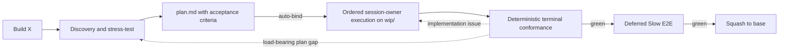

# GSD Core for OMP

GSD is an automatic, repository-backed software delivery flow for OMP: discovery, planning, execution, verification, review, handoff, and recovery. Talk to the agent normally. The GSD extension injects a small session bootstrap, selects one process owner from intent and validated state, and reads that skill only when needed.

Inspired by:

- [mattpocock/skills](https://github.com/mattpocock/skills) — action-oriented Markdown skills.
- [obra/superpowers](https://github.com/obra/superpowers) — the session-bootstrap and lazy-skill mechanism. GSD uses that activation idea, not Superpowers' workflow or skill bodies.
- [ponytail](https://github.com/DietrichGebert/ponytail) — YAGNI and lazy-senior-dev discipline.
- [open-gsd/gsd-core](https://github.com/open-gsd/gsd-core) — context engineering for long-running delivery work.

## Installation

From this checkout:

```bash
bash install.sh
```

The installer publishes a direct extension symlink at `~/.omp/agent/extensions/gsd-context.js`. There is no wrapper; target collisions fail closed before publication. It installs no persistent model agent or model-role configuration. Upgrade preflight removes only positively recognized managed legacy GSD agent links; regular files, directories, foreign links, live unrelated links, and unrelated agents fail closed or remain unchanged. It does not install an OMP command or copy/link skills into a user skill directory.

Skills are repository files read lazily by the extension and are never separately installed. Relocation of the checkout requires reinstall. Editing the extension in place requires a new OMP session; start a new OMP session after an extension edit. Editing a skill takes effect the next time that skill is selected.

## Use ordinary prompts

There is no special invocation syntax. Examples:

```text
Build X
Continue the active feature
Review this diff
Pause and save progress
Why does the import job crash after reconnecting?
Audit the codebase architecture
Fix this typo
```

The extension injects the hidden `gsd` bootstrap and a sorted metadata catalog. The bootstrap preserves same-session continuity, applies validated lifecycle state when relevant, and chooses exactly one visible primary skill. Full skill bodies stay out of context until selected. Read-only questions and tiny bounded edits remain direct: no GSD state scan, Git work, scratch artifact, or skill load.

If the checkout, hidden bootstrap, or visible catalog cannot be validated, the extension injects a visible `[GSD bootstrap unavailable]` diagnostic and leaves ordinary OMP behavior available. It never falls back to stale home-directory skills or a partial catalog.

## Feature flow



1. **Discovery.** `gsd-brainstorming` explores only relevant code, exposes risks and missing decisions, and converges on the smallest sufficient contract. Every feature classifies `Domain Impact`. When `docs/domain/index.md` exists, only affected mapped contexts are read and no broad domain scan is offered. When it is absent, semantic work bootstraps the feature context and may independently offer a broad bootstrap.
2. **Planning.** `gsd-to-plan` writes `.scratch/<feature>/plan.md` with exact Domain Impact, observable acceptance criteria, structured file operations and intents, interfaces, focused checks, and a SHA-256 binding. Domain paths belong to the same task as semantic code. The validated plan binds automatically — no approval prompt — and writes atomic `schema:v4` `.scratch/<feature>/state.toon` before ordered execution starts.
3. **Execution.** The current top-level session owner uses `gsd-executing-plans` to select `T1..TN` in order, rebuild each complete validated task slice, and dispatch every wave the contract validator proves file-, criterion-, and check-disjoint — a single-task wave included — to sub-agents that load `gsd-tdd` for observable work, perform Fast TDD Checks (RED→GREEN→refactor; no browser/resource-heavy task loops), and update affected domain docs to current production behavior in the same owning task. The owner reconciles each wave in plan order, commits each green checkpoint, updates `state.toon`, and repairs any returned red task inline; it implements inline only when dispatch is unavailable. GSD dispatches no child lifecycle work outside validated waves and never overlaps lifecycle work.
4. **Verification.** `gsd-verify` deterministically checks the exact plan/state binding, active-criterion/interface/task coverage, changed-path ownership, Domain Impact, code/domain drift, plan-ordered task diffs, explicit decisions/invariants/non-goals, and current-commit focused-check evidence. Only deterministic contract failures block.
5. **E2E gates.** Current-commit session-owner verification precedes Deferred Slow E2E.

A pause updates `.scratch/<feature>/state.toon`. A later “Continue the active feature” validates `schema:v4`, the exact plan path/hash, base/WIP identity, last green task/commit, and current tree before rebuilding one active task or terminal slice. Malformed, ambiguous, or mismatched authority stops instead of reconstructing scope from memory.
## Other intent-driven behavior

| You say | Primary behavior |
|---|---|
| “Fix this typo” | Direct Nano edit; no scratch, branch, commit, or GSD skill. |
| “Fix this small behavioral bug” | Session-owned Quick-fix with exact Domain Impact, hidden Ponytail context, Fast TDD, domain-drift verification, and no saved Ponytail preference. |
| “Review this diff” | Standalone read-only review; no merge mechanics. |
| “Why does X crash?” | Feedback-loop-first diagnosis with `gsd-diagnosing-bugs`. |
| “Design the public interface for X” | Named-seam mode in `gsd-codebase-architecture`. |
| “Audit the architecture” | Scoped audit mode in `gsd-codebase-architecture`. |
| “Pause and save progress” | Validated `state.toon` checkpoint through `gsd-handoff`. |
| “Continue the active feature” | Validated resume through `gsd-handoff`. |

For that Quick-fix route, the current session owner reads the exact hidden context path injected by the extension, writes the canonical Quick-fix plan, runs `gsd-tdd`, and hands the unchanged green WIP to `gsd-verify`. Ponytail remains absent from the visible catalog and runtime state.

Missing consumed artifacts do not trigger improvisation. The selected skill returns control to automatic selection or the recorded active owner with an actionable stop or transition.

## Domain-aligned delivery

`docs/domain/index.md` maps stable production contexts to shards. Shards describe current terms, actors, invariants, workflows, commands/events/outcomes, context relationships, and policies—not package layouts, refactor journals, or future designs. Production code, schemas, contracts, and tests remain authoritative when documentation drifts.

Every converged plan includes `Domain Impact`. Semantic code and its affected domain shards land in the same owning task; `gsd-verify` blocks completion on drift. If the index already exists, the workflow reads only affected mapped shards and never suggests a broad codebase/domain scan. A broad bootstrap is an optional decision only while creating the first index; declining it never skips mandatory feature-scoped documentation. The canonical `## Domain documentation` section in `AGENTS.md` gives future coding agents the same constraints.

`gsd-codebase-architecture` aligns backend and frontend boundaries to these production contexts while keeping domain/application policy framework-independent and adapters idiomatic. A context is not automatically a service, package, page, database, or deployment unit.

## Session-owner authority

The current top-level session is the sole lifecycle authority. It interprets the bound plan, dispatches each validated wave, inspects and merges what comes back, runs checks, commits, checkpoints, repairs inline, verifies conformance, runs Deferred Slow E2E, merges, and cleans up. Sub-agents author task code but hold no authority: nothing they produce counts until the owner reconciles it. A later top-level session assumes the same role only after canonical rehydration from `state.toon`, bound `plan.md`, and Git. No persistent model identity or custom agent configuration participates in authority.

## State and repository layout

- `.scratch/` is ignored and machine-local by default.
- `plan.md` remains the human-readable plan authority. The atomic `state.toon` snapshot binds its bytes and carries runtime progress; it does not replace design authority.
- Each feature executes on `wip/<feature>` and reaches the base branch as one squash commit.
- Durable multi-milestone publication uses `docs/gsd/<feature>/milestones.md`; final completion removes the ledger in the same green squash.
- A portable pause can explicitly synchronize committed WIP state and the exact feature scratch packet (`plan.md`, `state.toon`). Dirty-path snapshots require explicit consent; automatic context-pressure checkpoints stay local.

```text
docs/
└── domain/                           # bounded-context domain shards
extensions/
├── gsd-context.js                    # only runtime entry point (extension factory + facade)
└── gsd-context.d.ts                  # hand-maintained public type surface
lib/
├── gsd-contract.mjs                 # executable full-plan and Quick-fix grammar
├── gsd-fs.mjs                       # fd-anchored TOCTOU-hardened file primitives
├── gsd-state.mjs                    # state.toon schema, validation, and candidate discovery
└── gsd-bootstrap.mjs                # skill catalog, bootstrap renderer, recovery capsule, message utils
tools/
├── gsd-contract.mjs                 # plan and Quick-fix validator CLI
├── gsd-git.mjs                      # read-only derive-base and preflight queries
└── gsd-state.mjs                    # state.toon read/write/validate CLI
skills/
├── gsd/                              # hidden session bootstrap + canonical reference
├── gsd-brainstorming/                # discovery and requirements convergence
├── gsd-to-plan/                      # executable Markdown plan
├── gsd-executing-plans/              # ordered task execution, wave-dispatched by default
├── gsd-verify/                       # deterministic conformance and acceptance gate
├── gsd-handoff/                      # pause, recovery, and portable resume
├── gsd-tdd/                          # mandatory Fast TDD RED→GREEN→refactor for observable tasks
├── gsd-ponytail/                     # hidden level-free YAGNI context
├── gsd-diagnosing-bugs/              # hard-bug diagnosis loop
├── gsd-domain-modeling/              # current bounded-context documentation
└── gsd-codebase-architecture/        # named seams and scoped architecture audits
```

`extensions/gsd-context.d.ts` is a hand-maintained public type surface for `gsd-context.js`; `test/gsd-context-dts.test.js` asserts the facade's runtime exports stay mirrored in it.

Development checks: `bun test --timeout=30000 test/*.test.js` runs the full suite; `bun run lint` runs Biome with the repository rule set (currently zero diagnostics); `bun run format -- <path>` reformats the passed JS/MJS/JSON files through Biome (the existing hand-formatted tree is intentionally not bulk-reformatted); `bun run lint:shell` checks `install.sh` and requires a `shellcheck` install.

## Plan contract validation

The lifecycle validates actual plan authority through one production parser. New full plans use:

```bash
bun "<GSD_ROOT>/tools/gsd-contract.mjs" validate-plan --path .scratch/<feature>/plan.md
```

Execution resume, terminal entry, and pre-squash bind the same command to bound bytes:

```bash
bun "<GSD_ROOT>/tools/gsd-contract.mjs" validate-plan --path .scratch/<feature>/plan.md --expected-sha256 <64-hex>
```

Quick fixes select their distinct grammar:

```bash
bun "<GSD_ROOT>/tools/gsd-contract.mjs" validate-quick-fix --path .scratch/<feature>/plan.md
```

Successful plan validation emits minimal deterministic TOON with the plan kind, feature, SHA-256, and task count. Artifact failures emit structured TOON on stdout and exit 1, separating an unreadable file (`code: io-error`) from malformed authority (`code: invalid-artifact`); invalid invocations exit 2. The validator reads only a bounded real `.scratch/<feature>/plan.md` and never mutates plan, state, domain, or Git data.

## Verification

Run the deterministic repository contracts through the published script:

```bash
bun test --timeout=30000 test/*.test.js
```

That command is the published script body, which is also the direct form when no manifest is installed.

The supplementary model evaluator checks 40 workspace-state + prompt fixtures against the production bootstrap and visible catalog. It requires the strict JSON object `{ "decision": "...", "action": "...", "primarySkill": "gsd-..." | null }`; extra keys or prose fail.

```bash
bun test/eval/activation-eval.mjs
```

A non-zero exit is not automatically a routing regression: a chatty model can emit the exact expected decision and then append prose, which the strict contract rejects as `invalid exact JSON reply`. Read the reported prefix before treating a failure as a dispatch defect, and re-run that fixture with `--only <id>` to separate a deterministic refusal from an intermittent one.

It prefers the local `omp` binary, which needs no key and evaluates `gpt-5.6-luna` by default, reporting each model separately. Every question runs as one isolated non-interactive print with a neutral cwd and no discovered extensions, skills, rules, tools, or session. `GSD_EVAL_MODEL` takes a comma-separated model list, which is how any other model runs: `GSD_EVAL_MODEL=gemini-3.6-flash` evaluates that model alone, and listing several evaluates each. Without that binary, `GSD_EVAL_KEY=sk-...` uses the OpenAI-compatible endpoint instead, overridable through `GSD_EVAL_URL`; `GSD_EVAL_BACKEND=omp|http` forces one backend.
