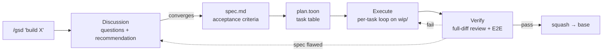

# Agentic Flow & Skills (GSD Core)

A complete A-to-Z autonomous agent execution flow (Discussion/Grilling, Planning, Executing, Verifying/Reviewing) designed to run primarily via OMP agents.

Inspired by:
*   [mattpocock/skills](https://github.com/mattpocock/skills) (Action-oriented, discipline-enforcing Markdown skills)
*   [lavish-axi](https://github.com/kunchenguid/lavish-axi) (HTML-first visual reporting and human-in-the-loop review)
*   [ponytail](https://github.com/DietrichGebert/ponytail) (YAGNI/lazy-senior-dev principles to minimize code bloat)
*   [open-gsd/gsd-core](https://github.com/open-gsd/gsd-core) (Meta-prompting/context-engineering framework to prevent context rot)

---

## Installation

Install ONLY the `gsd` master entry — the single trigger that routes and coordinates every sub-skill from context. You never install sub-skills separately:

```bash
bash install.sh
```

`install.sh` symlinks `skills/gsd` into `~/.agents/skills/gsd`, removes any stray sub-skill links from older installs, and initializes the `lavish-axi` submodule (the optional visual path — skip building it and skills degrade to terminal). Invoke `/gsd` on any prompt; it routes internally and loads the right sub-skill on demand.

You only ever type `/gsd` (plus what you want, in plain language). The `/gsd-<sub>` names that appear in the skills are the agent's own internal calls after it routes — not commands you register or invoke yourself.

---

## The complete feature flow

One feature, from idea to merged commit. You drive it with plain language; the agent routes.



### 1. Discuss — `/gsd build feature X`
New work routes to **Discussion**. The agent explores the codebase (targeted, git-scoped — no tree-wide crawling), asks clarifying questions only when the answer changes route/scope/action, stress-tests the idea (risks, edge cases, missing decisions), and recommends the **smallest approach that meets the ask** — a small ask converges to a 2–4-AC spec, never padded with retries/telemetry/config nobody asked for.

When you pick an approach and open questions close, the agent writes `.scratch/<feature>/spec.md` — context plus **checkable acceptance criteria** (`AC-1`, `AC-2`, …). This file is the contract every downstream stage reads. A large feature (would exceed ~10 tasks) is split into milestone specs (`<feature>-m1`, `-m2`, …), each running its own full cycle.

### 2. Plan — automatic
`gsd-to-plan` turns the converged spec into `.scratch/<feature>/plan.toon` — a token-efficient task table (`id, task, satisfies, files, test, status`). Rows are pointers, not payloads: detail lives in the spec; every AC must appear in some task's `satisfies`. Docs/comments-only tasks get `test:none`; anything that alters runtime behavior names a test.

### 3. Execute — per-task loop
`gsd-executing-plans` creates `wip/<feature>` (capturing your current branch as `base:` in `plan.toon`), then for each task:

1. **Dispatch** a fresh implementer subagent with just that task's brief.
2. **TDD** (`gsd-tdd`): one behavior test through the public interface → minimal code → green.
3. **Review**: a reviewer subagent checks the task diff — task-compliance AND code-quality. Critical/Important findings loop back until fixed.
4. **Commit** to `wip/<feature>` (code only) and mark the task `done` in the ledger.

Interrupt any time — the ledger plus `git log` mean a resumed session never redoes finished work.

### 4. Verify — the merge gate
`gsd-verify` reviews the **whole branch diff** against the spec: every non-superseded AC met (spec-compliance) + universal code-quality, then the project's full build+test suite, then an **E2E gate** for user-facing features (real user path via browser or script). Any Critical/Important finding, red suite, or failing E2E **blocks the merge**. Pass → squash to a single commit on your base branch; session artifacts never land there.

### 5. Next steps
Every response ends with numbered, non-technical choices — reply with a number:

```
Next steps (reply with number or text):
1. Generate the implementation plan
2. Start executing tasks
3. Audit codebase architecture
4. Pause & Save progress
```

---

## Other entry paths

| You say | What happens |
|---|---|
| "fix this typo" | **Nano-fix** — in-place fix on the current branch; no scratch, no branch, no gate |
| "fix this small bug" | **Quick-fix** — ponytail mindset, minimal `plan.toon`, `wip/` branch, code-quality verify only |
| "review this diff/PR" | Standalone review — read-only, two verdicts, no merge mechanics |
| "why does X crash?" (hard bug) | `gsd-diagnosing-bugs` — feedback-loop-first diagnosis discipline |
| "audit the architecture" | `gsd-improve-codebase-architecture` — deepening opportunities, you pick one |
| "continue" / "resume" | Reads the latest handoff and picks up exactly where it stopped |
| "pause" / "save progress" | `gsd-handoff` — compacts state to `.scratch/<feature>/handoff-<n>.toon` |
| "abandon feature X" | Safe cleanup — confirm, delete `wip/` branch safely, remove scratch |

**Toggles** (persist across sessions via handoff `settings[]`):
- `/gsd ponytail lite|full|ultra` · `stop ponytail` — force the laziest solution that works.
- `/gsd autosync on|off` — tri-state: unset asks once at first pause, `on` always syncs, `off` = remembered decline. See cross-machine below.

---

## Working across machines

`.scratch/` is **git-ignored and machine-local** by default — that's what keeps multi-feature routing and branch switching safe. You never need to remember a special phrase: the **first time you pause** (with a remote configured and autosync unset), the agent asks once — *"Sync to the remote so you can resume on another machine? (yes / no / always)"* — answer `always` and every future "pause" syncs automatically. Two mechanisms underneath:

**Explicit portable handoff** — say "pause, I'll continue on my laptop": the agent writes the handoff, surfaces any uncommitted mid-task code (with your approval it becomes a `wip snapshot` commit, erased later by the squash), then syncs scratch onto the WIP branch (force-add + pathspec'd commit, unconditional push). On the other machine, `/gsd continue` fetches, finds `origin/wip/<feature>`, checks it out — code, scratch, and approved in-flight work all materialize. At merge time the verify gate strips scratch, so nothing ever lands on your base branch.

**Autosync** — answer `always` at the ask-once (or `/gsd autosync on` anytime), then forget it: after every pause *and* after every completed task, scratch re-syncs and `wip/<feature>` is pushed. Answering `no` records the decline and never asks again (`/gsd autosync on` re-enables). Sync points are pauses and task boundaries — close the laptop mid-task **without pausing** and the other machine resumes from the last pushed task; pausing surfaces in-flight code and offers the snapshot (never committed without your OK). Requires a git remote (absent → stays machine-local and says so). The choice travels in the handoff's `settings[]`, so it holds after the switch.

---

## State Management & Resume Contract

1.  **Handoff Artifacts**: On pause, conversation context is compacted into `.scratch/<feature>/handoff-<n>.toon` — active `mode`, `phase`, resolved decisions, open questions, `next_action`, skills to reload, and active toggles (`settings[]`).
2.  **Progress Ledger**: Task plans and completion statuses live in `.scratch/<feature>/plan.toon` (`schema:v1`, `base:<branch>`). The executor reads this ledger plus `git log` on start and never redoes finished tasks.
3.  **Branch Isolation**: Every feature runs on an isolated `wip/<feature>` branch; the squash merge delivers exactly one commit to base.
4.  **No Re-litigation**: On resume the agent adopts the documented state and jumps to `next_action` — no re-inferring decisions, no re-interviewing.
5.  **Broken/missing state**: With no handoff, the agent reconstructs from durable artifacts — `plan.toon` (intended), `git log` (committed), `git status`/`diff` (uncommitted), `spec.md` (intent) — and resumes at the divergence.

---

## Workspace Structure

```
skills/
├── gsd/                              # Master Entry: routing, discussion & requirements
│   ├── SKILL.md
│   └── REFERENCE.md                  # Load-on-demand payloads (spec template, milestones, cleanup)
├── gsd-to-plan/                      # Spec decomposition & task-planning
├── gsd-executing-plans/              # Task execution & subagent dispatching
├── gsd-verify/                       # Terminal quality & compliance gate
├── gsd-handoff/                      # Handoff contracts, portable/autosync cross-machine sync
├── gsd-tdd/                          # Red-Green-Refactor & vertical slices (+ tests/mocking/refactoring docs)
├── gsd-ponytail/                     # Enforcing the YAGNI ladder & lazy code
├── gsd-diagnosing-bugs/              # Hard bugs & regressions diagnosis loop
├── gsd-domain-modeling/              # Aligning glossary & domain logic (CONTEXT.md)
├── gsd-codebase-design/              # Defining deep modules & interface design
├── gsd-improve-codebase-architecture/ # Deepening scans & architecture audits
└── gsd-lavish/                       # Visual HTML reporting & HITL (opt-in)
```

Sub-skills are NOT registered skills — they live as siblings of `gsd` in this repo. `/gsd` finds them by resolving its own symlink, so it works from any working directory:

```bash
SKILLS_DIR="$(dirname "$(readlink ~/.agents/skills/gsd)")"   # → …/this-repo/skills
```

then reads `$SKILLS_DIR/gsd-<sub>/SKILL.md`. No sub-skill registration needed.

### Auto-Update
`gsd` is symlinked, so any edit or `git pull` here applies instantly. Re-run `bash install.sh` only if you move the repo.

### Vendored Tool: Lavish Editor (`tools/lavish-axi`)
The Lavish Editor CLI is tracked as a **git submodule** pointing to [kunchenguid/lavish-axi](https://github.com/kunchenguid/lavish-axi). `bash install.sh` initializes the submodule. The visual path is opt-in — to enable it, build the CLI once (skills degrade to terminal if you don't):

```bash
cd tools/lavish-axi && pnpm install && pnpm run build
```

To pull upstream changes:

```bash
git submodule update --remote tools/lavish-axi
cd tools/lavish-axi && pnpm install && pnpm run build
```

### Tests
The skill set is a **string contract** — 86 tests pin routing rules, artifact formats, gates, and degradation paths:

```bash
node --test test/skills.test.js
```
