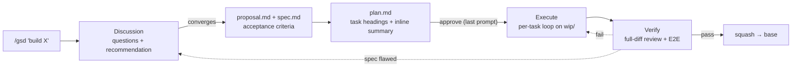

# Agentic Flow & Skills (GSD Core)

A complete A-to-Z autonomous agent execution flow (Discussion/Grilling, Planning, Executing, Verifying/Reviewing) designed to run primarily via OMP agents.

Inspired by:
*   [mattpocock/skills](https://github.com/mattpocock/skills) (Action-oriented, discipline-enforcing Markdown skills)
*   [lavish-axi](https://github.com/kunchenguid/lavish-axi) (HTML-first visual reporting and human-in-the-loop review)
*   [ponytail](https://github.com/DietrichGebert/ponytail) (YAGNI/lazy-senior-dev principles to minimize code bloat)
*   [open-gsd/gsd-core](https://github.com/open-gsd/gsd-core) (Meta-prompting/context-engineering framework to prevent context rot)

---

## Installation

Install the GSD command for OMP. You never install sub-skills separately:

```bash
bash install.sh
```

`install.sh` registers the GSD master entry point as a user command under `~/.omp/agent/commands/gsd.md` (which maps `/gsd`), cleans up legacy skill symlinks, initializes the `lavish-axi` submodule, and — when `pnpm` is available — builds the optional visual path automatically (no pnpm or a failed build → skills degrade to terminal). The command supplies the absolute `GSD_ROOT` path, allowing GSD to load all master and sub-skills directly from the checkout. Invoke `/gsd` on any prompt; it routes internally.

You only ever type `/gsd` (plus what you want, in plain language). The `/gsd-<sub>` names that appear in the skills are the agent's own internal calls after it routes — never commands you invoke yourself.
---

## The complete feature flow

One feature, from idea to merged commit. You drive it with plain language; the agent routes.



### 1. Discuss — `/gsd build feature X`
New work routes to **Discussion**. The agent explores the codebase (targeted, git-scoped — no tree-wide crawling), asks clarifying questions only when the answer changes route/scope/action, stress-tests the idea (risks, edge cases, missing decisions), and recommends the **smallest approach that meets the ask** — a small ask converges to a 2–4-AC spec, never padded with retries/telemetry/config nobody asked for.

When you pick an approach and open questions close, the agent writes `.scratch/<feature>/proposal.md` and `.scratch/<feature>/spec.md` (plus conditional `.scratch/<feature>/design.md`). These human-readable Markdown sources carry checkable ACs with a concrete action and expected observable result. A vague AC returns to Discussion; downstream stages read the exact same approved bytes. Large work splits into milestone features, each with its own cycle.

### 2. Plan — automatic, summarized inline
`gsd-to-plan` validates the converged packet and writes `.scratch/<feature>/plan.md`: ordered tasks with exact AC ownership, files, focused public-seam tests, and status. It prints the inline summary, records SHA-256 hashes for every present Markdown source, then asks one approval question. Approval is the last prompt of the cycle.

### 3. Execute — per-task loop, hands-free
Once approved, `gsd-executing-plans` creates `wip/<feature>` from the Base recorded in `plan.md`, then for each task — no questions, no menus, just progress reports:

1. **Dispatch** a fresh immutable JIT attempt TOON packet bound to the approved Markdown hashes.
2. **TDD** (`gsd-tdd`): one behavior test through the public interface → minimal code → green.
3. **Review and acceptance**: the reviewer checks task compliance and code quality; targeted runnable acceptance proves the AC.
4. **Commit and handoff**: commit green task-owned changes and record completion/next action in a fresh immutable runtime handoff; the approved Markdown packet remains unchanged.

Interrupt any time — immutable runtime handoffs plus `git log` mean a resumed session never redoes finished work.

`gsd-verify` reviews the **whole branch diff** against the spec: every non-superseded AC met (spec-compliance) + universal code-quality, then the project's full build+test suite, then an **acceptance/E2E gate** — the end-to-end user path for user-facing features (real user path via browser or script) *plus* an acceptance check for every non-superseded AC that is runtime-observable, absorbing any per-task `Acceptance Check: deferred`. Any Critical/Important finding, red suite, or failing acceptance/E2E **blocks the merge** — the pipeline stops and reports, never merging past a red gate. Pass → squash to a single commit on your base branch **automatically** (findings, build/E2E outcome, and the final commit are still reported); session artifacts never land there. An automated terminal state machine handles the squash commit, force-with-lease remote cleanup, local branch deletion, and writes a canonical `result.toon` marker to `.scratch/` to manage the post-merge cleanup lifecycle and block any implementation resume.

### 5. Next steps
Outside the post-approval pipeline, every response ends with numbered, non-technical choices — reply with a number:

```
Next steps (reply with number or text):
1. Generate the implementation plan
2. Audit codebase architecture
3. Pause & Save progress
```

After you approve the plan, no menu appears until the feature merges (or a hard blocker — spec flaw, unresolvable conflict, red gate — stops the run and reports why).

---

## Other entry paths

| You say | What happens |
|---|---|
| "fix this typo" | **Nano-fix** — in-place, completely git-free fix; no scratch, branch, commit, or gate |
| "fix this small bug" | **Quick-fix** — ponytail mindset, minimal `plan.md`, `wip/` branch, code-quality verify only |
| "review this diff/PR" | Standalone review — read-only, two verdicts, no merge mechanics |
| "why does X crash?" (hard bug) | `gsd-diagnosing-bugs` — feedback-loop-first diagnosis discipline |
| "audit the architecture" | `gsd-improve-codebase-architecture` — deepening opportunities, you pick one |
| "continue" / "resume" | Reads the latest handoff and picks up exactly where it stopped |
| "pause" / "save progress" | `gsd-handoff` — compacts state to `.scratch/<feature>/handoff-<n>.toon` |
| "abandon feature X" | Safe cleanup — confirm, delete `wip/` branch safely, remove scratch |

**Toggles** (persist across sessions via handoff `settings[]`):
- `/gsd ponytail lite|full|ultra` · `stop ponytail` — force the laziest solution that works.
- `/gsd autosync on|off` — tri-state: unset asks once at the first user-requested pause when a remote exists; `on` syncs only at safe sync points; `off` is a remembered decline with no re-ask. See cross-machine below.

---

## Working across machines

`.scratch/` is **git-ignored and machine-local** by default — that's what keeps multi-feature routing and branch switching safe. At the **first user-requested pause** with a remote configured and autosync unset, the agent asks once — *"Sync to the remote so you can resume on another machine? (yes / no / always)"*. `always` persists autosync `on`, but synchronization still occurs only at the safe points below. Two mechanisms underneath:

**Explicit portable handoff** — say "pause, I'll continue on my laptop": the agent writes the handoff and lists any uncommitted mid-task paths. It asks exactly *"Snapshot these listed paths before portable sync? (yes / no)"*; only `yes` creates a `wip snapshot` commit, while `no` leaves those dirty paths local. It then syncs scratch and committed WIP state onto the WIP branch (force-add + pathspec'd commit, unconditional push). On the other machine, `/gsd continue` fetches, finds `origin/wip/<feature>`, and checks it out. At merge time the verify gate strips scratch, so nothing under `.scratch/` lands on the base branch.

**Autosync** — `on` runs only at safe sync points: a user-requested pause or portable handoff, or a completed task commit with a clean non-scratch tree. If the tree is dirty at a completed-task boundary, sync and push are deferred locally without asking. An automatic context-pressure handoff during uncommitted task work also stays machine-local even when autosync is `on`; a user-requested portable pause uses the exact snapshot consent above. `off` records the decline and never asks again (`/gsd autosync on` re-enables). No remote means machine-local operation with an explicit notice. The choice travels in the handoff's `settings[]`, so it survives the switch.
A user-requested non-portable pause never snapshots unrelated work: dirty paths stay local without a snapshot question, and autosync carries only committed state plus scratch. The dirty-snapshot question is reserved for an explicit portable-resume request.

---

## State Management & Resume Contract

1.  **Handoff Artifacts**: On pause, conversation context is compacted into `.scratch/<feature>/handoff-<n>.toon` — active `mode`, `phase`, resolved decisions, open questions, `next_action`, skills to reload, and active toggles (`settings[]`).
2.  **Runtime progress**: Immutable attempt and handoff TOON records completed tasks, verified evidence, and next action; the approved Markdown packet remains byte-for-byte unchanged.
3.  **Branch Isolation**: Every feature runs on an isolated `wip/<feature>` branch; the squash merge delivers exactly one commit to base.
4.  **No Re-litigation**: On resume the agent verifies the Markdown source binding, adopts runtime state, and jumps to `next_action`.
5.  **Broken/missing state**: Missing, malformed, or hash-mismatched packet state is a Spec escalation; runtime state never reconstructs human requirements.
6.  **Milestone Ledger**: Large features split tasks into milestones via `docs/gsd/<feature>/milestones.toon` (never in scratch). Non-final milestones update the current row status from pending to done, while the final milestone atomically deletes the ledger path from base-present to absent in the same squash commit.

---

## Workspace Structure

```
skills/
├── gsd/                              # Master Entry: routing, discussion & requirements
│   ├── SKILL.md
│   └── REFERENCE.md                  # Load-on-demand payloads (spec template, milestones, cleanup)
├── gsd-to-plan/                      # Spec decomposition & task-planning
├── gsd-executing-plans/              # Task execution & subagent dispatching
├── gsd-verify/                       # Terminal quality & compliance gate
├── gsd-handoff/                      # Handoff contracts, portable/autosync cross-machine sync
├── gsd-tdd/                          # Red-Green-Refactor & vertical slices (+ tests/mocking/refactoring docs)
├── gsd-ponytail/                     # Enforcing the YAGNI ladder & lazy code
├── gsd-diagnosing-bugs/              # Hard bugs & regressions diagnosis loop
├── gsd-domain-modeling/              # Aligning glossary & domain logic (docs/domain.toon)
├── gsd-codebase-design/              # Defining deep modules & interface design
├── gsd-improve-codebase-architecture/ # Deepening scans & architecture audits
└── gsd-lavish/                       # Visual HTML reporting & HITL (opt-in)
```

All sub-skills carry a **direct-invocation guard** — selected standalone with their consumed artifacts missing, they route back through `/gsd` instead of improvising. Since the OMP command supplies the absolute `GSD_ROOT`, GSD loads master and sub-skills directly by absolute path from the checkout.

### Auto-Update
All master and sub-skills are loaded directly from the checkout path, so any edit or `git pull` here applies instantly. Re-run `bash install.sh` only if you move the repo.
### Vendored Tool: Lavish Editor (`tools/lavish-axi`)
The Lavish Editor CLI is tracked as a **git submodule** pointing to [kunchenguid/lavish-axi](https://github.com/kunchenguid/lavish-axi). `bash install.sh` initializes the submodule and builds the CLI automatically when `pnpm` is available. No pnpm? Build once manually (skills degrade to terminal until then):

```bash
cd tools/lavish-axi && pnpm install && pnpm run build
```

To pull upstream changes:

```bash
git submodule update --remote tools/lavish-axi
cd tools/lavish-axi && pnpm install && pnpm run build
```

### Tests
The skill set is a **string contract** — the suite pins routing rules, artifact formats, gates, and degradation paths:

```bash
node --test test/skills.test.js
```

A second, **opt-in** harness proves a model *reading* the master skill actually routes correctly: 14 workspace-state + prompt fixtures, checked in two modes (`classify` — route/skill decision as JSON; `trace` — the literal `Route N → gsd-*` first line). It calls an OpenAI-compatible endpoint and is never part of `node --test`:

```bash
GSD_EVAL_KEY=sk-... node test/eval/route-eval.mjs   # GSD_EVAL_URL / GSD_EVAL_MODEL to override
```
