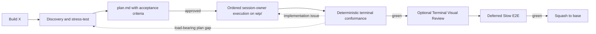

# GSD Core for OMP

GSD is an automatic, repository-backed software delivery flow for OMP: discovery, planning, execution, verification, review, handoff, and recovery. Talk to the agent normally. The GSD extension injects a small session bootstrap, selects one process owner from intent and validated state, and reads that skill only when needed.

Inspired by:

- [mattpocock/skills](https://github.com/mattpocock/skills) — action-oriented Markdown skills.
- [obra/superpowers](https://github.com/obra/superpowers) — the session-bootstrap and lazy-skill mechanism. GSD uses that activation idea, not Superpowers' workflow or skill bodies.
- Root-owned `tools/lavish` — Bun-native interactive browser feedback and image capture.
- [ponytail](https://github.com/DietrichGebert/ponytail) — YAGNI and lazy-senior-dev discipline.
- [open-gsd/gsd-core](https://github.com/open-gsd/gsd-core) — context engineering for long-running delivery work.

## Installation

From this checkout:

```bash
bash install.sh
```

The installer publishes a direct extension symlink at `~/.omp/agent/extensions/gsd-context.js` and, when Bun builds the internal tool successfully, a direct `lavish` symlink at `~/.omp/agent/bin/lavish`. There is no wrapper; target collisions fail closed before publication. It installs no persistent model agent or model-role configuration. Upgrade preflight removes only positively recognized managed legacy GSD agent links; regular files, directories, foreign links, live unrelated links, and unrelated agents fail closed or remain unchanged. It does not install an OMP command or copy/link skills into a user skill directory.

Skills are repository files read lazily by the extension and are never separately installed. Relocation of the checkout requires reinstall. Editing the extension in place requires a new OMP session; start a new OMP session after an extension edit. Editing a skill takes effect the next time that skill is selected.

## Use ordinary prompts

There is no special invocation syntax. Examples:

```text
Build X
Continue the active feature
Review this diff
Pause and save progress
Why does the import job crash after reconnecting?
Audit the codebase architecture
Fix this typo
```

The extension injects the hidden `gsd` bootstrap and a sorted metadata catalog. The bootstrap preserves same-session continuity, applies validated lifecycle state when relevant, and chooses exactly one visible primary skill. Full skill bodies stay out of context until selected. Read-only questions and tiny bounded edits remain direct: no GSD state scan, Git work, scratch artifact, or skill load.

If the checkout, hidden bootstrap, or visible catalog cannot be validated, the extension injects a visible `[GSD bootstrap unavailable]` diagnostic and leaves ordinary OMP behavior available. It never falls back to stale home-directory skills or a partial catalog.

## Feature flow



1. **Discovery.** `gsd-brainstorming` explores only relevant code, exposes risks and missing decisions, and converges on the smallest sufficient contract. Large work is split into independently deliverable milestones.
2. **Planning.** `gsd-to-plan` writes `.scratch/<feature>/plan.md` with observable acceptance criteria, structured file operations and intents, applicable prototype references, interfaces, focused checks, and a SHA-256 binding. The single post-plan action surface offers approve and execute, Build prototype with Lavish, revise, and pause/save. Approval writes atomic `schema:v3` `.scratch/<feature>/state.toon`.
3. **Execution.** The current top-level session owner uses `gsd-executing-plans` to select `T1..TN` in order, rebuild each complete validated task slice, load `gsd-tdd` for observable work, perform Fast TDD Checks inline (RED→GREEN→refactor; no browser/resource-heavy task loops), commit each green checkpoint, and update `state.toon`. GSD dispatches no implementation, repair, diagnosis, architecture, or verification child task and never overlaps lifecycle work.
4. **Verification.** `gsd-verify` deterministically checks the exact plan/state binding, active-criterion/interface/task coverage, changed-path ownership, plan-ordered task diffs, explicit decisions/invariants/non-goals, and current-commit focused-check evidence. Only malformed binding, ownership/coverage mismatch, explicit contract contradiction, unresolved change, or a red deterministic check blocks.
5. **Visual and E2E gates.** Current-commit session-owner verification precedes Terminal Visual Review and Deferred Slow E2E. Eligible work opens the typed Lavish session and attaches its completion-aware poll before reporting that feedback is monitored. Ordered comments and image metadata remain machine-local under `.lavish/`, are acknowledged as recorded-not-applied, and never change source until the separate terminal `Start fixing` action. Source changes invalidate verification and visual acceptance.

A pause updates `.scratch/<feature>/state.toon`. A later “Continue the active feature” validates `schema:v3`, the exact plan path/hash, base/WIP identity, last green task/commit, current tree, and plan-referenced artifacts before rebuilding one active task or terminal slice. Malformed, ambiguous, or mismatched authority stops instead of reconstructing scope from memory.

Lavish feedback stays finite and interactive: `Queue` keeps drafts private, `Send now` wakes the attached `poll <session-id>`, and each agent reply is published before polling resumes. Direct `feedback <session-id>` reads ordered machine-local history without serving as a wake path. Use `end <session-id>` explicitly when review is complete; source changes invalidate the evidence.

## Other intent-driven behavior

| You say | Primary behavior |
|---|---|
| “Fix this typo” | Direct Nano edit; no scratch, branch, commit, or GSD skill. |
| “Fix this small behavioral bug” | Minimal quick-fix lifecycle with Ponytail discipline. |
| “Review this diff” | Standalone read-only review; no merge mechanics. |
| “Why does X crash?” | Feedback-loop-first diagnosis with `gsd-diagnosing-bugs`. |
| “Design the public interface for X” | Interface and module design with `gsd-codebase-design`. |
| “Audit the architecture” | Deepening scan with `gsd-improve-codebase-architecture`. |
| “Pause and save progress” | Validated `state.toon` checkpoint through `gsd-handoff`. |
| “Continue the active feature” | Validated resume through `gsd-handoff`. |

Missing consumed artifacts do not trigger improvisation. The selected skill returns control to automatic selection or the recorded active owner with an actionable stop or transition.

## Session-owner authority

The current top-level session is the sole lifecycle authority. It interprets the approved plan, edits the canonical WIP, runs checks, commits, checkpoints, verifies conformance, routes visual feedback, runs Deferred Slow E2E, merges, and cleans up. A later top-level session assumes the same role only after canonical rehydration from `state.toon`, bound `plan.md`, Git, and required prototype references. No persistent model identity or custom agent configuration participates in authority.

## State and repository layout

- `.scratch/` is ignored and machine-local by default.
- `plan.md` remains the human-readable pre-approval authority. The atomic `state.toon` snapshot binds its bytes and carries runtime progress; it does not replace design authority.
- Each feature executes on `wip/<feature>` and reaches the base branch as one squash commit.
- Durable multi-milestone publication uses `docs/gsd/<feature>/milestones.md`; final completion removes the ledger in the same green squash.
- A portable pause can explicitly synchronize committed WIP state and the exact feature scratch packet (`plan.md`, `state.toon`, promoted prototype refs). Dirty-path snapshots require explicit consent; automatic context-pressure checkpoints stay local.

```text
extensions/
└── gsd-context.js                    # only runtime entry point
skills/
├── gsd/                              # hidden session bootstrap + canonical reference
├── gsd-brainstorming/                # discovery and requirements convergence
├── gsd-to-plan/                      # executable Markdown plan
├── gsd-executing-plans/              # sequential session-owner task execution
├── gsd-verify/                       # deterministic conformance and acceptance gate
├── gsd-handoff/                      # pause, recovery, and portable resume
├── gsd-tdd/                          # mandatory Fast TDD RED→GREEN→refactor for observable tasks
├── gsd-ponytail/                     # YAGNI ladder
├── gsd-diagnosing-bugs/              # hard-bug diagnosis loop
├── gsd-domain-modeling/              # bounded-context documentation
├── gsd-codebase-design/              # deep modules and interface design
└── gsd-improve-codebase-architecture/# architecture audit
```

## Lavish editor

Lavish is regular tracked Bun source in `tools/lavish`; installation builds it locally and performs no external Lavish fetch.

Build the internal tool with:

```bash
bun run --cwd tools/lavish build
```

Open a local HTML prototype or an already-running app URL. Start the returned
poll command before claiming that feedback is monitored:

```bash
bun tools/lavish/src/cli.ts prototype /absolute/path/to/fixture.html
bun tools/lavish/src/cli.ts app http://127.0.0.1:3000
bun tools/lavish/src/cli.ts sessions
bun tools/lavish/src/cli.ts poll <session-id> --after 0 --after-reply 0
bun tools/lavish/src/cli.ts poll <session-id> --after <cursor> --after-reply <reply-cursor> --agent-reply "Applied the requested changes."
bun tools/lavish/src/cli.ts feedback <session-id>
bun tools/lavish/src/cli.ts end <session-id>
```

Prototype sessions serve regular local HTML; app sessions open the real URL in
its own CDP-driven tab without an iframe. Both use the same collapsible review
drawer. Interact passes native events through. Annotate highlights elements or
selected text and opens a contextual card. Queue drafts remain private to the
daemon session until Send now atomically delivers the ordered batch to the
waiting poll. Uploaded, pasted, current-viewport, and dragged-region images are
bounded attachments; full-document capture is unavailable. Runtime data lives
under ignored `.lavish/`; browser profiles live outside the repository and are
isolated per project.

## Verification

Run the deterministic repository contracts:

```bash
node --test test/*.test.js
```

The supplementary model evaluator checks 31 workspace-state + prompt fixtures against the production bootstrap and visible catalog. It requires the strict JSON object `{ "decision": "...", "action": "...", "primarySkill": "gsd-..." | null }`; extra keys or prose fail.

```bash
GSD_EVAL_KEY=sk-... node test/eval/activation-eval.mjs
```

Use `GSD_EVAL_URL` and `GSD_EVAL_MODEL` to override the OpenAI-compatible endpoint and model.
