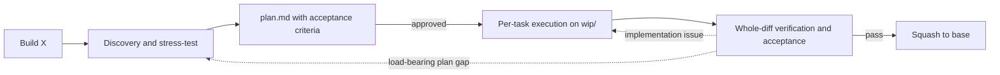

# GSD Core for OMP

GSD is an automatic, repository-backed software delivery flow for OMP: discovery, planning, execution, verification, review, handoff, and recovery. Talk to the agent normally. The GSD extension injects a small session bootstrap, selects one process owner from intent and validated state, and reads that skill only when needed.

Inspired by:

- [mattpocock/skills](https://github.com/mattpocock/skills) — action-oriented Markdown skills.
- [obra/superpowers](https://github.com/obra/superpowers) — the session-bootstrap and lazy-skill mechanism. GSD uses that activation idea, not Superpowers' workflow or skill bodies.
- [lavish-axi](https://github.com/kunchenguid/lavish-axi) — optional HTML-first visual reporting and human review.
- [ponytail](https://github.com/DietrichGebert/ponytail) — YAGNI and lazy-senior-dev discipline.
- [open-gsd/gsd-core](https://github.com/open-gsd/gsd-core) — context engineering for long-running delivery work.

## Installation

From this checkout:

```bash
bash install.sh
```

The installer creates one direct symlink, `~/.omp/agent/extensions/gsd-context.js`, to the tracked `extensions/gsd-context.js`. It uses no wrapper and fails closed on an extension collision. It does not install an OMP command or copy/link skills into a user skill directory. Supported legacy GSD registrations are removed conservatively only after the extension has published successfully; ambiguous user-owned objects are preserved with a warning.

Skills are repository files read lazily by the extension and are never separately installed. Relocation of the checkout requires reinstall. Since the symlink points to the tracked extension file, editing the extension in place does not require reinstall, but it does require you to start a new OMP session so that OMP loads the updated extension. Editing a skill in place takes effect the next time that skill is selected.

## Use ordinary prompts

There is no special invocation syntax. Examples:

```text
Build X
Continue the active feature
Review this diff
Pause and save progress
Why does the import job crash after reconnecting?
Audit the codebase architecture
Fix this typo
```

The extension injects the hidden `gsd` bootstrap and a sorted metadata catalog. The bootstrap preserves same-session continuity, applies validated lifecycle state when relevant, and chooses exactly one visible primary skill. Full skill bodies stay out of context until selected. Read-only questions and tiny bounded edits remain direct: no GSD state scan, Git work, scratch artifact, or skill load.

If the checkout, hidden bootstrap, or visible catalog cannot be validated, the extension injects a visible `[GSD bootstrap unavailable]` diagnostic and leaves ordinary OMP behavior available. It never falls back to stale home-directory skills or a partial catalog.

## Feature flow



1. **Discovery.** `gsd-brainstorming` explores only the relevant code, exposes risks and missing decisions, and converges on the smallest sufficient contract. Large work is split into independently deliverable milestones.
2. **Planning.** `gsd-to-plan` writes `.scratch/<feature>/plan.md` with observable acceptance criteria, exact task ownership, interfaces, focused checks, and a SHA-256 binding. Approval writes the first immutable execution handoff.
3. **Execution.** `gsd-executing-plans` creates `wip/<feature>`, dispatches bounded task attempts, applies TDD where behavior changes, reviews each task, records evidence, commits green work, and writes the next immutable handoff.
4. **Verification.** `gsd-verify` reviews the whole branch diff against every active acceptance criterion, runs the project build and test suite, and exercises runtime-observable acceptance paths. A red gate blocks merging. A green gate squashes to one base-branch commit and performs result cleanup.

A pause writes `.scratch/<feature>/handoff-<n>.toon`. A later “Continue the active feature” validates the packet, its Markdown bindings, and Git state before resuming exactly one next action. Malformed, ambiguous, or hash-mismatched state stops instead of reconstructing requirements from memory.

## Other intent-driven behavior

| You say | Primary behavior |
|---|---|
| “Fix this typo” | Direct Nano edit; no scratch, branch, commit, or GSD skill. |
| “Fix this small behavioral bug” | Minimal quick-fix lifecycle with Ponytail discipline. |
| “Review this diff” | Standalone read-only review; no merge mechanics. |
| “Why does X crash?” | Feedback-loop-first diagnosis with `gsd-diagnosing-bugs`. |
| “Design the public interface for X” | Interface and module design with `gsd-codebase-design`. |
| “Audit the architecture” | Deepening scan with `gsd-improve-codebase-architecture`. |
| “Pause and save progress” | Validated handoff through `gsd-handoff`. |
| “Continue the active feature” | Validated resume through `gsd-handoff`. |

Missing consumed artifacts do not trigger improvisation. The selected skill returns control to automatic selection or the recorded active owner with an actionable stop or transition.

## Dual-Agent Model Roles

GSD relies on two persistent role bindings sourced from the OMP configuration:
- `modelRoles.task`: Binds the persistent primary executor that performs all task implementation, runs focused checks, and carries out self-verification.
- `modelRoles.advisor`: Binds the independent persistent reviewer that performs whole-diff terminal review and re-verification.

Other harnesses, custom agent definitions, or external model configuration files are explicitly deferred.

## State and repository layout

- `.scratch/` is ignored and machine-local by default.
- `plan.md` remains the human-readable pre-approval authority. Immutable TOON records bind its bytes and carry runtime progress; they do not replace its design authority.
- Each feature executes on `wip/<feature>` and reaches the base branch as one squash commit.
- Durable multi-milestone publication uses `docs/gsd/<feature>/milestones.md`; final completion removes the ledger in the same green squash.
- A portable pause can explicitly synchronize committed WIP state and scratch data. Dirty-path snapshots require explicit consent; automatic context-pressure handoffs stay local.

```text
extensions/
└── gsd-context.js                    # only runtime entry point
skills/
├── gsd/                              # hidden session bootstrap + canonical reference
├── gsd-brainstorming/                # discovery and requirements convergence
├── gsd-to-plan/                      # executable Markdown plan
├── gsd-executing-plans/              # task execution and bounded delegation
├── gsd-verify/                       # terminal review and acceptance gate
├── gsd-handoff/                      # pause, recovery, and portable resume
├── gsd-tdd/                          # behavior-first red/green/refactor
├── gsd-ponytail/                     # YAGNI ladder
├── gsd-diagnosing-bugs/              # hard-bug diagnosis loop
├── gsd-domain-modeling/              # bounded-context documentation
├── gsd-codebase-design/              # deep modules and interface design
├── gsd-improve-codebase-architecture/# architecture audit
└── gsd-lavish/                       # optional visual reporting
```

## Optional Lavish editor

The Lavish CLI is a Git submodule at `tools/lavish-axi`.

**Primary path:** `bash install.sh` updates configured submodules from remote with detached checkout (`git submodule update --init --remote --checkout --recursive`) and rebuilds the optional Lavish visual path when the submodule tip changed or `dist/cli.mjs` is missing and `pnpm` is available. Network, Git, pnpm, or build failure does not block extension installation; visual output degrades to terminal. Install never auto-commits the parent repository's submodule pointer.

No pnpm? Build it manually:

```bash
cd tools/lavish-axi && pnpm install && pnpm run build
```

Optional manual pin:

```bash
git submodule update --init --remote --checkout tools/lavish-axi
cd tools/lavish-axi && pnpm install && pnpm run build && cd ../..
git add tools/lavish-axi
git commit -m "Pin lavish-axi submodule tip"
```

## Verification

Run the deterministic repository contracts:

```bash
node --test test/*.test.js
```

The supplementary model evaluator checks 31 workspace-state + prompt fixtures against the production bootstrap and visible catalog. It requires the strict JSON object `{ "decision": "...", "action": "...", "primarySkill": "gsd-..." | null }`; extra keys or prose fail.

```bash
GSD_EVAL_KEY=sk-... node test/eval/activation-eval.mjs
```

Use `GSD_EVAL_URL` and `GSD_EVAL_MODEL` to override the OpenAI-compatible endpoint and model.
