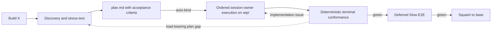

# GSD Core

GSD is an automatic, repository-backed software delivery flow: discovery, planning, execution, verification, review, handoff, and recovery. The harness-generic core renders one small session bootstrap and the recovery capsule; each supported host installs it through the unified plugin CLI. Talk to the agent normally. The injected bootstrap classifies the prompt, selects one process owner from intent and validated state, and reads that skill only when needed.

Inspired by:

- [mattpocock/skills](https://github.com/mattpocock/skills) — align before building. Its `skills/productivity/grilling/SKILL.md` states three rules GSD shares: every question carries the agent's recommended answer, finding facts is the agent's job rather than the user's, and the session ends only when the frontier of open decisions is empty. GSD takes those into `gsd-brainstorming` ("Recommend answers for all questions. Batch independent questions; ask dependent questions sequentially by branch"), and differs at the triage front door on purpose: an ambiguous prompt gets exactly one question, not a round. That repo's README names GSD among frameworks that "own the process" and remove control, which this revamp answers with direct-first triage, one canonical `plan.md`, and plain editable skill files.
- [obra/superpowers](https://github.com/obra/superpowers) — hook-injected skill activation. Its `hooks/hooks.json` registers one `SessionStart` handler for `startup|clear|compact`, and `hooks/session-start` injects the whole `using-superpowers` skill as `hookSpecificOutput.additionalContext`, so a session starts already knowing it must invoke a skill before any response. GSD takes the injection idea and each host's own context field, but publishes an explicit catalog whose selected owner must read the named `skillPath`, instead of relying on tool-based skill discovery. It takes none of Superpowers' workflow or skill bodies.
- [Fission-AI/openspec](https://github.com/Fission-AI/openspec) — schema'd change proposals: one folder per change holding `proposal.md`, `specs/` deltas written as `## ADDED Requirements` then `### Requirement:` / `#### Scenario:`, `design.md`, and `tasks.md`, archived into a durable spec corpus after merge. GSD keeps the one-folder change and the durable corpus, but folds the contract into the single canonical `plan.md` (`Scope`, `Acceptance Criteria`, `Interfaces`, `Invariants`, `Non-goals`) plus the `docs/domain/*.md` behavior shards, with Domain Impact classification standing in for the ADDED/MODIFIED/REMOVED deltas, instead of a parallel `spec.md`.
- [ponytail](https://github.com/DietrichGebert/ponytail) — YAGNI and lazy-senior-dev discipline.
- [open-gsd/gsd-core](https://github.com/open-gsd/gsd-core) — context engineering for long-running delivery work.

Those three claims were verified against the upstream files named above on 2026-09-19, and every deliberate difference is recorded in [docs/decisions/0019](docs/decisions/0019-reference-repo-alignment.md).

## Installation

From this checkout, use the unified CLI:

```bash
bun bin/gsd.mjs install
```

The interactive prompt recommends `all`; choose one agent with:

```bash
bun bin/gsd.mjs install --agent omp
bun bin/gsd.mjs install --agent claude-code
bun bin/gsd.mjs install --agent codex
```

Add `--dry-run` to print the exact host commands. The CLI builds one self-contained bundle at `~/.gsd/marketplace/gsd` (override the CLI home with `--home <path>`), then uses each host's own plugin system:

- OMP: `omp plugin link <bundle>`
- Claude Code: `claude plugin marketplace add <marketplace> --scope user` then `claude plugin install gsd@gsd-local --scope user`
- Codex: `codex plugin marketplace add <marketplace>` then `codex plugin add gsd@gsd-local`

The bundle carries `lib/`, the canonical skills and tools under `core/`, only the six visible skills in the host-facing `skills/` directory, reviewer definitions, and host manifests. Hidden runtime skills stay internal. Claude Code and Codex hooks still require their normal trust review. Uninstall is the inverse CLI operation:

Relocation of the checkout does not require reinstall because the installed plugin is a copied, self-contained bundle. Editing the checkout does not update the installed bundle; run `bun bin/gsd.mjs install` again to refresh it, then follow the selected host's normal reload and trust behavior.

```bash
bun bin/gsd.mjs uninstall --agent claude-code
```

Uninstall runs only the host's native plugin uninstall command and removes the local bundle when no selected agent still uses it. It does not inspect or modify files outside that plugin registration. Unrelated hooks, skills, agents, settings, and marketplaces stay untouched.

## Use ordinary prompts

There is no special invocation syntax. Examples:

```text
Build X
Continue the active feature
Review this diff
Pause and save progress
Why does the import job crash after reconnecting?
Audit the codebase architecture
Fix this typo
```

The extension injects the hidden `gsd` bootstrap and a sorted metadata catalog. The bootstrap preserves same-session continuity, applies validated lifecycle state when relevant, and chooses exactly one visible primary skill. Full skill bodies stay out of context until selected. Read-only questions and tiny bounded edits remain direct: no GSD state scan, Git work, scratch artifact, or skill load.

If the checkout, hidden bootstrap, or visible catalog cannot be validated, the extension injects a visible `[GSD bootstrap unavailable]` diagnostic and leaves the host's ordinary behavior available. It never falls back to stale home-directory skills or a partial catalog.

## What it costs

GSD is built to stay out of the way most of the time. Each number below is held by a
test, so it cannot drift quietly:

- One bootstrap per session. `skills/gsd/SKILL.md` caps at 800 words, and the rendered
  bootstrap (the master body plus the sorted catalog) currently measures 879 words;
  that is the `bootstrap_words` value in every committed eval report.
- Nothing per turn. An ordinary prompt injects zero bytes: the adapters emit only at
  session boundaries and deduplicate against the payload already in the transcript. A
  prompt that needs nothing costs nothing.
- The canon is on demand, and read by section. `skills/gsd/REFERENCE.md` caps at 6700
  words and is never injected; a flow reads only the `§` sections it names, whole only
  when no step names a required contract. No owner depends on most of it: the widest
  named set is 8645 bytes of the 50330-byte file, about 1879 tokens against about 10966,
  and a test caps any owner at 10000 bytes (decision 0020).
- One visible skill body at a time. The six visible skills cap at 9850 words in total,
  and the bootstrap carries their metadata, not their bodies.
- Recovery is bounded and rare. A capsule is emitted only after a compaction and fails
  closed above 4000 bytes rather than truncating.

The caps live in `test/skills-frontmatter.test.js` § AC-4 with the reason for each
raise, and the per-turn silence is pinned per host in `test/adapters-claude-code.test.js`,
`test/adapters-codex.test.js`, and `test/gsd-context-extension.test.js`.

## Feature flow



1. **Discovery.** `gsd-brainstorming` explores only relevant code, exposes risks and missing decisions, and converges on the smallest sufficient contract. Every feature classifies `Domain Impact`. When `docs/domain/index.md` exists, only affected mapped contexts are read and no broad domain scan is offered. When it is absent, semantic work bootstraps the feature context and may independently offer a broad bootstrap.
2. **Planning.** `gsd-to-plan` writes `.scratch/<feature>/plan.md` with exact Domain Impact, observable acceptance criteria, structured file operations and intents, interfaces, focused checks, and a SHA-256 binding. Domain paths belong to the same task as semantic code. The validated plan binds automatically — no approval prompt — and writes atomic `schema:v4` `.scratch/<feature>/state.toon` before ordered execution starts.
3. **Execution.** The current top-level session owner uses `gsd-executing-plans` to select `T1..TN` in order, rebuild each complete validated task slice, verify each dispatch prompt against the slice before sending it, and execute each wave the contract validator proves file-, criterion-, and check-disjoint: a single-task wave executes inline, while a wave of two or more dispatches one task per sub-agent, each in its own isolated workspace, or serially in plan order when isolation is unavailable. Every observable task performs Fast TDD Checks (RED→GREEN→refactor; no browser/resource-heavy task loops) and updates affected domain docs to current production behavior in the same owning task. The owner reconciles each returned task in plan order through the ordered five-layer gate — the sub-agent's own report is inadmissible, `verify-task-branch` proves branch ancestry, slice scope, and untouched `.scratch/`, each new or changed test must fail on the wave base, deleted or skipped guards are rejected, and every merged task's focused check re-runs on `wip/<feature>` — before it commits each green checkpoint, updates `state.toon`, and repairs any integrity failure or red task inline. GSD dispatches no lifecycle work outside validated waves and never overlaps lifecycle work.
4. **Verification.** `gsd-verify` deterministically checks the exact plan/state binding, active-criterion/interface/task coverage, changed-path ownership, Domain Impact, code/domain drift, plan-ordered task diffs, explicit decisions/invariants/non-goals, and current-commit focused-check evidence. Only deterministic contract failures block.
5. **E2E gates.** Current-commit session-owner verification precedes Deferred Slow E2E.

A pause updates `.scratch/<feature>/state.toon`. A later “Continue the active feature” validates `schema:v4`, the exact plan path/hash, base/WIP identity, last green task/commit, and current tree before rebuilding one active task or terminal slice. Malformed, ambiguous, or mismatched authority stops instead of reconstructing scope from memory.
## Other intent-driven behavior

| You say | Primary behavior |
|---|---|
| “Fix this typo” | Direct Nano edit; no scratch, branch, commit, or GSD skill. |
| “Fix this small behavioral bug” | Session-owned Quick-fix with exact Domain Impact, hidden Ponytail context, Fast TDD, domain-drift verification, and no saved Ponytail preference. |
| “Review this diff” | Standalone read-only review; no merge mechanics. |
| “Why does X crash?” | Feedback-loop-first diagnosis with `gsd-diagnosing-bugs`. |
| “Design the public interface for X” | Architecture and domain discovery in `gsd-brainstorming`. |
| “Audit the architecture” | Architecture and domain discovery in `gsd-brainstorming`. |
| “Pause and save progress” | Validated `state.toon` checkpoint through `gsd-handoff`. |
| “Continue the active feature” | Validated resume through `gsd-handoff`. |

For that Quick-fix route, the current session owner reads the exact hidden context path injected by the extension, writes the canonical Quick-fix plan, performs Fast TDD, and hands the unchanged green WIP to `gsd-verify`. Ponytail remains absent from the visible catalog and runtime state.

Missing consumed artifacts do not trigger improvisation. The selected skill returns control to automatic selection or the recorded active owner with an actionable stop or transition.

## Domain-aligned delivery

`docs/domain/index.md` maps stable production contexts to shards. Shards describe current terms, actors, invariants, workflows, commands/events/outcomes, context relationships, and policies—not package layouts, refactor journals, or future designs. Production code, schemas, contracts, and tests remain authoritative when documentation drifts.

Every converged plan includes `Domain Impact`. Semantic code and its affected domain shards land in the same owning task; `gsd-verify` blocks completion on drift. If the index already exists, the workflow reads only affected mapped shards and never suggests a broad codebase/domain scan. A broad bootstrap is an optional decision only while creating the first index; declining it never skips mandatory feature-scoped documentation. The canonical `## Domain documentation` section in `AGENTS.md` gives future coding agents the same constraints.

Architecture and domain discovery in `gsd-brainstorming` align backend and frontend boundaries to these production contexts while keeping domain/application policy framework-independent and adapters idiomatic. A context is not automatically a service, package, page, database, or deployment unit.

## Session-owner authority

The current top-level session is the sole lifecycle authority. It interprets the bound plan, verifies each dispatch prompt against the slice before sending, executes a single-task wave inline, dispatches each validated wave of two or more tasks (concurrent tasks in separate isolated workspaces, serially in plan order when isolation is unavailable), inspects and merges what comes back, runs checks, commits, checkpoints, repairs inline, verifies conformance, runs Deferred Slow E2E, merges, and cleans up. Sub-agents author task code but hold no authority: nothing they produce counts until the owner reconciles it. A later top-level session assumes the same role only after canonical rehydration from `state.toon`, bound `plan.md`, and Git. No persistent model identity or custom agent configuration participates in authority.

## State and repository layout

- `.scratch/` is ignored and machine-local by default.
- `plan.md` remains the human-readable plan authority. The atomic `state.toon` snapshot binds its bytes and carries runtime progress; it does not replace design authority.
- Each feature executes on `wip/<feature>` and reaches the base branch as one squash commit.
- Durable multi-milestone publication uses `docs/gsd/<feature>/milestones.md`; final completion removes the ledger in the same green squash.
- A portable pause can explicitly synchronize committed WIP state and the exact feature scratch packet (`plan.md`, `state.toon`). Dirty-path snapshots require explicit consent; automatic context-pressure checkpoints stay local.

```text
adapters/
├── plugin/                          # cross-host plugin CLI and bundle builder
├── omp/                              # OMP adapter: extension factory and public types
├── claude-code/                      # Claude Code adapter: hooks and reviewer agent
└── codex/                            # Codex adapter: hooks and reviewer agent
bin/
└── gsd.mjs                          # executable entry for the unified host plugin CLI
docs/
└── domain/                           # bounded-context domain shards
extensions/
├── gsd-context.js                    # stable OMP entry: re-exports adapters/omp/gsd-context.js
└── gsd-context.d.ts                  # stable type entry: re-exports adapters/omp/gsd-context.d.ts
lib/
├── gsd-contract.mjs                 # executable full-plan and Quick-fix grammar
├── gsd-domain.mjs                   # domain index/shard grammar and AGENTS.md canonical section
├── gsd-fs.mjs                       # pinned directory chain TOCTOU-hardened file primitives
├── gsd-milestone.mjs                # milestone ledger grammar and deterministic completion
├── gsd-record.mjs                   # decision and design record grammar
├── gsd-session-context.mjs          # recovery capsule render, session marker store, current-request join
├── gsd-state.mjs                    # state.toon schema, validation, and candidate discovery
└── gsd-bootstrap.mjs                # skill catalog, bootstrap renderer, recovery capsule, message utils
tools/
├── gsd-contract.mjs                 # plan and Quick-fix validator CLI
├── gsd-domain.mjs                   # domain index/shard validator CLI
├── gsd-git.mjs                      # read-only derive-base, preflight, and verify-task-branch queries
├── gsd-milestone.mjs                # milestone ledger validate/complete CLI
├── gsd-record.mjs                   # decision and design record validator CLI
└── gsd-state.mjs                    # state.toon read/write/validate CLI
skills/
├── gsd/                              # hidden session bootstrap + canonical reference
├── gsd-brainstorming/                # discovery and requirements convergence
├── gsd-to-plan/                      # executable Markdown plan
├── gsd-executing-plans/              # ordered task execution, wave-dispatched by default
├── gsd-verify/                       # deterministic conformance and acceptance gate
├── gsd-handoff/                      # pause, recovery, and portable resume
├── gsd-tdd/                          # hidden Fast TDD reference
├── gsd-ponytail/                     # hidden level-free YAGNI context
├── gsd-diagnosing-bugs/              # hard-bug diagnosis loop
├── gsd-domain-modeling/              # hidden bounded-context documentation reference
└── gsd-codebase-architecture/        # hidden named-seam and audit reference
```

`adapters/omp/gsd-context.d.ts` is a hand-maintained public type surface for the OMP adapter; `test/gsd-context-dts.test.js` asserts the facade's runtime exports stay mirrored in it. The `extensions/gsd-context.{js,d.ts}` paths remain stable importer entry points, and each is a thin re-export of the adapter (decision 0015).

Development checks: `bun test --timeout=30000 test/*.test.js` runs the full suite; `bun run lint` runs Biome with the repository rule set (currently zero diagnostics); and `bun run format -- <path>` reformats the passed JS/MJS/JSON files through Biome (the existing hand-formatted tree is intentionally not bulk-reformatted).

## Plan contract validation

The lifecycle validates actual plan authority through one production parser. New full plans use:

```bash
bun "<GSD_ROOT>/tools/gsd-contract.mjs" validate-plan --path .scratch/<feature>/plan.md
```

Execution resume, terminal entry, and pre-squash bind the same command to bound bytes:

```bash
bun "<GSD_ROOT>/tools/gsd-contract.mjs" validate-plan --path .scratch/<feature>/plan.md --expected-sha256 <64-hex>
```

Quick fixes select their distinct grammar:

```bash
bun "<GSD_ROOT>/tools/gsd-contract.mjs" validate-quick-fix --path .scratch/<feature>/plan.md
```

Successful plan validation emits minimal deterministic TOON with the plan kind, feature, SHA-256, and task count. Artifact failures emit structured TOON on stdout and exit 1, separating an unreadable file (`code: io-error`) from malformed authority (`code: invalid-artifact`); invalid invocations exit 2. The validator reads only a bounded real `.scratch/<feature>/plan.md` and never mutates plan, state, domain, or Git data.

## Verification

Run the deterministic repository contracts through the published script:

```bash
bun test --timeout=30000 test/*.test.js
```

That command is the published script body, which is also the direct form when no manifest is installed.

The supplementary model evaluator checks 40 workspace-state + prompt fixtures against the production bootstrap and visible catalog. It requires the strict JSON object `{ "decision": "...", "action": "...", "primarySkill": "gsd-..." | null }`; extra keys or prose fail.

```bash
bun test/eval/activation-eval.mjs
```

A non-zero exit is not automatically a routing regression: a chatty model can emit the exact expected decision and then append prose, which the strict contract rejects as `invalid exact JSON reply`. Read the reported prefix before treating a failure as a dispatch defect, and re-run that fixture with `--only <id>` to separate a deterministic refusal from an intermittent one.

An exit code of 3 is never a routing verdict: it means the backend itself failed (a rejected credential or a dead endpoint), so the run aborts before any fixture is scored instead of reporting the failure as `0/N checks pass`.

Two scopes measure two different things. Activation alone is the lower bound: only the injected bootstrap travels, while the row-level completed-state matrix lives in the on-demand canon an owner reads before lifecycle work. `GSD_EVAL_CANON=1 bun test/eval/eval-models.mjs` adds that canon section, which is what a live owner holds when it routes lifecycle work, and the two-pass report records which scope produced its numbers in a `scope` field. `GSD_EVAL_JOB_TIMEOUT` (milliseconds, default 120000) raises the per-call ceiling for slower models, which matters once several models share one report.

The two committed reports on the current bytes each score three models in one run, at fingerprint `65be16b66a1f`. With the canon loaded, `omp/anthropic/claude-sonnet-5` scored 36/40 first attempt, `omp/google-antigravity/gemini-3.8-flash` 35/40, and `omp/anthropic/claude-opus-5` 38/40, for 109/120 (90.8%) overall. The bootstrap-only lower bound scored 25/40, 32/40, and 31/40 for 88/120 (73.3%), and its misses concentrate on the terminal-state rows (`result-*`) and the compaction rows — exactly the rows the on-demand canon owns, which is why the canon scope is the operative measure and the bootstrap stays lean with a `§` pointer instead of that matrix.

Run-to-run spread is larger than any wording effect measured here, so the numbers above are one run each and the difference between them is not a route verdict. Earlier runs of nearby bytes scored 105, 108, 109, and 110 of 120 on the bootstrap-only scope, while the canon scope has scored 109, 118, and 119 across several sets of bytes. What keeps the residual misses bounded is that each reached skill requires bound `state.toon` and an invocation guard that admits only validated bound plan state, so a capsule resume that misroutes there stops instead of executing; `test/skills-lifecycle.test.js` locks that boundary. Read every number as a sample of a small labeled set rather than a constant.

Every report also carries the fingerprint of the bytes it measured: `bootstrap_sha256` and `bootstrap_words` for the rendered bootstrap, plus `canon_sha256` and `canon_words` when the canon section traveled. Those word counts describe the text the model received, so they run above the source-file cap numbers. The repository root is normalized out of the hash, so two checkouts of one revision agree, and any change to the bootstrap, the visible skill catalog, or the canon moves it. A report whose fingerprint does not match the tree is history, not evidence: re-run the evaluator instead of quoting its number. The suite enforces that rule. `test/skills-lifecycle.test.js` recomputes the live fingerprint the same way the runners do and fails when a committed report, or the prefix quoted in this README, no longer matches the bytes on disk.

The triage front door is scored by its own runner, so neither axis leaks the other's vocabulary into its prompt: `bun test/eval/triage-eval.mjs` checks `test/eval/triage-fixtures.json` against the same production bootstrap and requires the strict JSON object `{ "route": "..." }` for all six routes. The 13 fixtures hold one or more per route, and the runner writes the same fingerprint-bound report shape to `test/eval/triage-report.json`, overridable with `--report-path`.

Before decision 0018 defined the route boundaries, the bootstrap left three of them to inference, and they cost 28 of 156 first-attempt routes: `omp/anthropic/claude-sonnet-5` scored 69/91 across seven runs, `omp/google-antigravity/gemini-3.8-flash` 34/39 across three, and `omp/anthropic/claude-opus-5` 25/26 across two. On those bytes the same three models routed 153 of 156 first attempts (98.1%): gemini-3.8-flash and claude-opus-5 never missed across any run, while sonnet-5 landed 62 of 65 across five runs. Sonnet's residual misses were `multi-task-refactor` and `codebase-facts`, both intermittent, and both fixtures moved between runs before the change too — run-to-run noise on a small labeled set rather than a boundary the wording could still fix. The committed report scores all three models in one run, and on the current bytes they routed 12/13, 13/13, and 13/13 for 38/39. Re-run the axis after any bootstrap or canon edit and check the fingerprint before quoting any report.

It prefers the local `omp` binary, which needs no key and evaluates `gpt-5.6-luna` by default, reporting each model separately. Every question runs as one isolated non-interactive print with a neutral cwd and no discovered extensions, skills, rules, tools, or session. `GSD_EVAL_MODEL` takes a comma-separated model list, which is how any other model runs: `GSD_EVAL_MODEL=gemini-3.6-flash` evaluates that model alone, and listing several evaluates each. Without that binary, `GSD_EVAL_KEY=sk-...` uses the OpenAI-compatible endpoint instead, overridable through `GSD_EVAL_URL`; `GSD_EVAL_BACKEND=omp|http` forces one backend.
