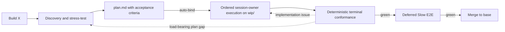

# GSD Core

GSD is an automatic, repository-backed software delivery flow: discovery, planning, execution, verification, review, pause, and resume. The harness-generic core renders one small session bootstrap and the recovery capsule; each supported host installs it through the unified plugin CLI. Talk to the agent normally. The injected bootstrap suggests the lightest route for the prompt and reads a skill only when one fits.

Inspired by:

- [mattpocock/skills](https://github.com/mattpocock/skills) — align before building. Its `skills/productivity/grilling/SKILL.md` states three rules GSD shares: every question carries the agent's recommended answer, finding facts is the agent's job rather than the user's, and the session ends only when the frontier of open decisions is empty. GSD takes those into `gsd-brainstorming` ("Recommend answers for all questions. Batch independent questions; ask dependent questions sequentially by branch"), and differs at the triage front door on purpose: an ambiguous prompt gets exactly one question, not a round. That repo's README names GSD among frameworks that "own the process" and remove control, which this revamp answers with direct-first triage, one canonical `plan.md`, and plain editable skill files.
- [obra/superpowers](https://github.com/obra/superpowers) — hook-injected skill activation. Its `hooks/hooks.json` registers one `SessionStart` handler for `startup|clear|compact`, and `hooks/session-start` injects the whole `using-superpowers` skill as `hookSpecificOutput.additionalContext`, so a session starts already knowing it must invoke a skill before any response. GSD takes the injection idea and each host's own context field, but publishes an explicit catalog whose selected owner must read the named `skillPath`, instead of relying on tool-based skill discovery. It takes none of Superpowers' workflow or skill bodies.
- [Fission-AI/openspec](https://github.com/Fission-AI/openspec) — schema'd change proposals: one folder per change holding `proposal.md`, `specs/` deltas written as `## ADDED Requirements` then `### Requirement:` / `#### Scenario:`, `design.md`, and `tasks.md`, archived into a durable spec corpus after merge. GSD keeps the one-folder change and the durable corpus, but folds the contract into the single canonical `plan.md` (`Scope`, `Acceptance Criteria`, `Interfaces`, `Invariants`, `Non-goals`) plus the `docs/domain/*.md` behavior shards, with Domain Impact classification standing in for the ADDED/MODIFIED/REMOVED deltas, instead of a parallel `spec.md`.
- [ponytail](https://github.com/DietrichGebert/ponytail) — YAGNI and lazy-senior-dev discipline.
- [open-gsd/gsd-core](https://github.com/open-gsd/gsd-core) — context engineering for long-running delivery work.

Those three claims were verified against the upstream files named above on 2026-09-19, and every deliberate difference is recorded in [docs/decisions/0019](docs/decisions/0019-reference-repo-alignment.md).

## Installation

From this checkout, use the unified CLI:

```bash
bun bin/gsd.mjs install
```

The interactive prompt recommends `all`; choose one agent with:

```bash
bun bin/gsd.mjs install --agent omp
bun bin/gsd.mjs install --agent claude
bun bin/gsd.mjs install --agent codex
```

Add `--dry-run` to print the exact host commands. The CLI builds one self-contained bundle at `~/.gsd/marketplace/gsd` (override the CLI home with `--home <path>`), then uses each host's own plugin system:

- OMP: `omp plugin link <bundle>`
- Claude Code: `claude plugin marketplace add <marketplace> --scope user`, then `claude plugin uninstall gsd@gsd-local --scope user --keep-data` (skipped without error when nothing is installed), then `claude plugin install gsd@gsd-local --scope user`. Claude Code keeps its cached copy of a plugin while the version is unchanged, so the uninstall is what lets a reinstall of the same version pick up the rebuilt bundle.
- Codex: `codex plugin marketplace add <marketplace>` then `codex plugin add gsd@gsd-local`

The bundle carries `lib/`, the canonical skills and tools under `core/`, only the five visible skills in the host-facing `skills/` directory, and host manifests. Hidden runtime skills stay internal. Claude Code and Codex hooks still require their normal trust review. Uninstall is the inverse CLI operation:

```bash
bun bin/gsd.mjs uninstall --agent claude
```

Uninstall runs only the host's native plugin uninstall command and removes the local bundle when no selected agent still uses it. It does not inspect or modify files outside that plugin registration. Unrelated hooks, skills, agents, settings, and marketplaces stay untouched.

Relocation of the checkout does not require reinstall because the installed plugin is a copied, self-contained bundle. Editing the checkout does not update the installed bundle; run `bun bin/gsd.mjs install` again to refresh it, then follow the selected host's normal reload and trust behavior.

### Skills-only install

A harness without a GSD adapter can still use the skills if it discovers skill directories:

```bash
bun bin/gsd.mjs install --skills-dir <harness skills directory>
bun bin/gsd.mjs uninstall --skills-dir <harness skills directory>
```

Install builds the same bundle, then writes the five visible skills plus a visible `gsd` router skill into that directory, with every `<GSD_ROOT>` resolved to the bundle's absolute `core/` path. The router carries the bootstrap body, so the harness should load it first. What the adapters add is missing (decision 0029): every skills-only session shares the owner `skills-only`, so two parallel sessions in one work tree are not scoped apart, and no recovery capsule follows compaction; `continue` resumes through `gsd-executing-plans`. Install refuses to overwrite a skill directory GSD did not write, and uninstall removes only the directories it marked.

### Sub-agent profiles

GSD ships no model names. Choose which model (or OMP agent) each sub-agent profile uses per host; values land in `~/.gsd/settings.json` (or `$GSD_HOME/settings.json`) and survive uninstall:

```bash
bun bin/gsd.mjs config set scout.claude haiku                    # read-only exploration
bun bin/gsd.mjs config set worker.codex a6/grok-4.7              # dispatched implementation
bun bin/gsd.mjs config set worker.omp task                       # OMP values are agent names
bun bin/gsd.mjs config list
```

Claude Code values are aliases its Agent tool accepts (`sonnet`, `opus`, `haiku`, ...); point an alias at a custom model with Claude Code's `ANTHROPIC_DEFAULT_<ALIAS>_MODEL` environment variables. Codex values are model ids; OMP values are agent names whose model roles pick the model. Unset profiles keep each host's default sub-agent model. New sessions pick up changes without reinstalling.

## Use ordinary prompts

There is no special invocation syntax. Examples:

```text
Build X
Continue the active feature
Review this diff
Pause and save progress
Why does the import job crash after reconnecting?
Audit the codebase architecture
Fix this typo
```

The extension injects the hidden `gsd` bootstrap and a sorted metadata catalog. The bootstrap preserves same-session continuity, applies validated lifecycle state when relevant, and chooses exactly one visible primary skill. Full skill bodies stay out of context until selected. Read-only questions and tiny bounded edits remain direct: no GSD state scan, Git work, scratch artifact, or skill load.

If the checkout, hidden bootstrap, or visible catalog cannot be validated, the extension injects a visible `[GSD bootstrap unavailable]` diagnostic and leaves the host's ordinary behavior available. It never falls back to stale home-directory skills or a partial catalog.

## What it costs

GSD is built to stay out of the way most of the time. The figures below describe the
current tree; the tests named in each bullet pin only the cap or budget it names.

- One bootstrap per session. `skills/gsd/SKILL.md` caps at 450 words
  (`test/bootstrap-first-action.test.js`), and the rendered bootstrap (the master body
  plus the sorted catalog) currently measures 513 words; that is the `bootstrap_words`
  value in every committed eval report.
- Nothing per turn. An ordinary prompt injects zero bytes: the adapters emit only at
  session boundaries and deduplicate against the payload already in the transcript. A
  prompt that needs nothing costs nothing.
- The canon is on demand, and read by section. `skills/gsd/REFERENCE.md` is never
  injected; a flow reads only the `§` sections it names, whole only when no step names a
  required contract (decision 0020). No test caps its size.
- One visible skill body at a time. The bootstrap carries the five visible skills'
  metadata, not their bodies, and the summed description bytes stay under the budget in
  `test/skills-frontmatter.test.js`.
- Recovery is bounded and rare. A capsule is emitted only after a compaction and fails
  closed above 4000 bytes rather than truncating.

The capsule cap lives in `test/gsd-context-extension.test.js`, and the per-turn silence is
pinned per host in `test/adapters-claude-code.test.js`, `test/adapters-codex.test.js`, and
`test/gsd-context-extension.test.js`.

## Feature flow


```mermaid
flowchart LR
    U["Build X"] --> B[Discovery and stress-test]
    B --> P[plan.md with acceptance criteria]
    P -->|auto-bind| E[Ordered session-owner execution on wip/]
    E --> V[Deterministic terminal conformance]
    V -->|green| S[Deferred Slow E2E]
    S -->|green| M[Merge to base]
    V -.implementation issue.-> E
    V -.load-bearing plan gap.-> B
```

1. **Discovery.** `gsd-brainstorming` explores only relevant code, exposes risks and missing decisions, and converges on the smallest sufficient contract. `Domain Impact` is written only when a touched repository has `docs/domain/index.md` or the user accepted a domain bootstrap. When the index exists, only affected mapped contexts are read and no broad domain scan is offered. When it is absent, the feature omits `Domain Impact` and writes no domain docs; a bootstrap is offered once, and only when the feature introduces lasting business terms.
2. **Planning.** `gsd-to-plan` writes `.scratch/<feature>/plan.md` with observable acceptance criteria, structured file operations and intents, focused checks; Domain Impact, interfaces, and the other sections are optional and appear only when they carry information. Domain paths belong to the same task as semantic code. The validated plan binds automatically — no approval prompt — and writes atomic `schema:v0.0.3` `.scratch/<feature>/state.toon` before ordered execution starts.
3. **Execution.** The current top-level session owner uses `gsd-executing-plans` to select `T1..TN` in order, rebuild each complete validated task slice, verify each dispatch prompt against the slice before sending it, and execute each wave the contract validator proves file-, criterion-, and check-disjoint: a single-task wave executes inline, while a wave of two or more dispatches one task per sub-agent, each in its own isolated workspace, or serially in plan order when isolation is unavailable. Every observable task performs Fast TDD Checks (RED→GREEN→refactor; no browser/resource-heavy task loops) and updates affected domain docs to current production behavior in the same owning task. The owner reconciles each returned task in plan order through a two-step wave gate — the sub-agent's own report is inadmissible, `verify-task-branch` proves branch ancestry, slice scope, and untouched `.scratch/`, and every merged task's focused check re-runs on `wip/<feature>` — before it commits each green checkpoint, updates `state.toon`, and repairs any integrity failure or red task inline. GSD dispatches no lifecycle work outside validated waves and never overlaps lifecycle work.
4. **Verification.** `gsd-verify` deterministically revalidates the plan against the recorded base, active-criterion/interface/task coverage, changed-path ownership, Domain Impact, code/domain drift, plan-ordered task diffs, explicit decisions/invariants/non-goals, and current-commit focused-check evidence. Only deterministic contract failures block.
5. **E2E gates.** Current-commit session-owner verification precedes Deferred Slow E2E.

A pause updates `.scratch/<feature>/state.toon`. A later “Continue the active feature” validates `schema:v0.0.3`, the plan path and grammar, base/WIP identity, last green task/commit, and current tree before rebuilding one active task or terminal slice. Malformed, ambiguous, or mismatched authority stops instead of reconstructing scope from memory.
## Other intent-driven behavior

| You say | Primary behavior |
|---|---|
| “Fix this typo” | Direct Nano edit; no scratch, branch, commit, or GSD skill. |
| “Fix this small behavioral bug” | Direct quick fix: a `derive-base` branch check, then edit plus a focused test; no packet, plan, commit, or verification gate. |
| “Review this diff” | Standalone read-only review; no merge mechanics. |
| “Why does X crash?” | Feedback-loop-first diagnosis with `gsd-diagnosing-bugs`. |
| “Design the public interface for X” | Architecture and domain discovery in `gsd-brainstorming`. |
| “Audit the architecture” | Architecture and domain discovery in `gsd-brainstorming`. |
| “Pause and save progress” | Validated `state.toon` checkpoint through `gsd-executing-plans`. |
| “Continue the active feature” | Validated resume through `gsd-executing-plans`. |

Missing consumed artifacts do not trigger improvisation. The selected skill returns control to automatic selection or the recorded active owner with an actionable stop or transition.

## Domain-aligned delivery

`docs/domain/index.md` maps stable production contexts to shards. Shards describe current terms, actors, invariants, workflows, commands/events/outcomes, context relationships, and policies—not package layouts, refactor journals, or future designs. Production code, schemas, contracts, and tests remain authoritative when documentation drifts.

Domain docs are opt-in: they apply only in repositories with `docs/domain/index.md` or after the user accepts a bootstrap, and only there does a plan include `Domain Impact`. Semantic code and its affected domain shards land in the same owning task; `gsd-verify` blocks completion on drift. If the index already exists, the workflow reads only affected mapped shards and never suggests a broad codebase/domain scan. A broad bootstrap is an optional decision only while creating the first index. The canonical `## Domain documentation` section in `AGENTS.md` gives future coding agents the same constraints.

Architecture and domain discovery in `gsd-brainstorming` align backend and frontend boundaries to these production contexts while keeping domain/application policy framework-independent and adapters idiomatic. A context is not automatically a service, package, page, database, or deployment unit.

## Session-owner authority

The current top-level session is the sole lifecycle authority. It interprets the bound plan, verifies each dispatch prompt against the slice before sending, executes a single-task wave inline, dispatches each validated wave of two or more tasks (concurrent tasks in separate isolated workspaces, serially in plan order when isolation is unavailable), inspects and merges what comes back, runs checks, commits, checkpoints, repairs inline, verifies conformance, runs Deferred Slow E2E, merges, and cleans up. Sub-agents author task code but hold no authority: nothing they produce counts until the owner reconciles it. A later top-level session assumes the same role only after canonical rehydration from `state.toon`, bound `plan.md`, and Git. No persistent model identity or custom agent configuration participates in authority.

### Several agents in one repository

One work tree has one checked-out branch, so a second agent (say Codex while Claude runs a feature) would edit inside the first feature's `wip/<feature>` branch. Give each agent its own worktree instead: `git worktree add -b <branch> ../<repo>-<branch> <base>`, then start the agent there. Each worktree keeps its own HEAD and `.scratch/`, and its packet records `<branch>` as base, which you then merge or open a pull request from. `derive-base` refuses a `wip/*` HEAD with `code: head-is-wip`, and the quick-fix route checks it before the first edit, so an agent on someone else's WIP branch stops and asks instead of mixing the two features; a session on its own WIP branch carries on.

The same holds for every repository a cross-repo plan lists: if another feature's branch is checked out there, give that repository a worktree too and list its path under `## Repos`. Within a shared work tree, agents create a WIP branch only from a clean tree, stage their own paths by name, and never stash, clean, or reset paths their task does not own. A packet has one owner: `gsd-state.mjs set` refuses an `owner=` that differs from the recorded one unless the user handed the packet over and the session passes `--takeover`. Before a merge, `preflight` blocks with `base-advanced` when another feature already merged into the base, so the combination is re-verified before it lands.

## State and repository layout

- `.scratch/` is ignored and machine-local by default.
- `plan.md` remains the human-readable plan authority. The atomic `state.toon` snapshot binds the plan path and base and carries runtime progress; it does not replace design authority.
- Each feature executes on `wip/<feature>`; after the terminal gate the owner asks whether to merge it into the base branch or open a pull request.
- A feature too large for one plan is split into parts in `.scratch/<feature>/parts.md`, a plain checklist; each part is delivered as its own feature `<feature>-pN`.
- A plan touching several repositories lists them under `## Repos` (`| Repo | Path | Base |`) and tags each task with `- **Repo:**`; every repository gets its own `wip/<feature>`, `.scratch/` stays in the repository that holds the plan, and one merge-or-PR answer covers them all.

```text
adapters/
├── plugin/                          # cross-host plugin CLI and bundle builder
├── omp/                              # OMP adapter: extension factory and public types
├── claude-code/                      # Claude Code adapter hooks
└── codex/                            # Codex adapter hooks
bin/
└── gsd.mjs                          # executable entry for the unified host plugin CLI
docs/
└── domain/                           # bounded-context domain shards
extensions/
├── gsd-context.js                    # stable OMP entry: re-exports adapters/omp/gsd-context.js
└── gsd-context.d.ts                  # stable type entry: re-exports adapters/omp/gsd-context.d.ts
lib/
├── gsd-contract.mjs                 # executable plan grammar
├── gsd-domain.mjs                   # domain index/shard grammar and AGENTS.md canonical section
├── gsd-fs.mjs                       # pinned directory chain TOCTOU-hardened file primitives
├── gsd-record.mjs                   # decision and design record grammar
├── gsd-session-context.mjs          # recovery capsule render, session marker store, current-request join
├── gsd-settings.mjs                 # user sub-agent profiles in <GSD home>/settings.json
├── gsd-state.mjs                    # state.toon schema, validation, and candidate discovery
└── gsd-bootstrap.mjs                # skill catalog, bootstrap renderer, recovery capsule, message utils
tools/
├── gsd-contract.mjs                 # plan validator CLI
├── gsd-domain.mjs                   # domain index/shard validator CLI
├── gsd-git.mjs                      # read-only derive-base, preflight, and verify-task-branch queries
├── gsd-record.mjs                   # decision and design record validator CLI
└── gsd-state.mjs                    # state.toon read/write/validate CLI
skills/
├── gsd/                              # hidden session bootstrap + canonical reference
├── gsd-brainstorming/                # discovery and requirements convergence
├── gsd-to-plan/                      # executable Markdown plan
├── gsd-executing-plans/              # ordered task execution, pause, and resume
├── gsd-verify/                       # deterministic conformance and acceptance gate
├── gsd-tdd/                          # hidden Fast TDD reference
├── gsd-diagnosing-bugs/              # hard-bug diagnosis loop
├── gsd-domain-modeling/              # hidden bounded-context documentation reference
└── gsd-codebase-architecture/        # hidden named-seam and audit reference
```

`adapters/omp/gsd-context.d.ts` is a hand-maintained public type surface for the OMP adapter; `test/gsd-context-dts.test.js` asserts the facade's runtime exports stay mirrored in it. The `extensions/gsd-context.{js,d.ts}` paths remain stable importer entry points, and each is a thin re-export of the adapter (decision 0015).

Development checks: `bun test --timeout=30000 test/*.test.js` runs the full suite; `bun run lint` runs Biome with the repository rule set (currently zero diagnostics); and `bun run format -- <path>` reformats the passed JS/MJS/JSON files through Biome (the existing hand-formatted tree is intentionally not bulk-reformatted).

## Plan contract validation

The lifecycle validates actual plan authority through one production parser. New full plans use:

```bash
bun "<GSD_ROOT>/tools/gsd-contract.mjs" validate-plan --path .scratch/<feature>/plan.md
```

Execution resume and terminal entry run the same command against the recorded base:

```bash
bun "<GSD_ROOT>/tools/gsd-contract.mjs" validate-plan --path .scratch/<feature>/plan.md --expected-base <base_ref>
```

Successful plan validation emits minimal deterministic TOON with the plan kind, feature, base, and task count. Artifact failures emit structured TOON on stdout and exit 1, separating an unreadable file (`code: io-error`) from malformed authority (`code: invalid-artifact`); invalid invocations exit 2. `merge-message` takes the same flags and prints the terminal merge message instead: a merge subject, the Summary, and active criterion titles, used for `git merge -F` and as a pull request body. The validator reads only a bounded real `.scratch/<feature>/plan.md` and never mutates plan, state, domain, or Git data.

## Verification

Run the deterministic repository contracts through the published script:

```bash
bun test --timeout=30000 test/*.test.js
```

That command is the published script body, which is also the direct form when no manifest is installed.

The supplementary model evaluator checks 33 workspace-state + prompt fixtures against the production bootstrap and visible catalog. It requires the strict JSON object `{ "decision": "...", "action": "...", "primarySkill": "gsd-..." | null }`; extra keys or prose fail.

```bash
bun test/eval/activation-eval.mjs
```

A non-zero exit is not automatically a routing regression: a chatty model can emit the exact expected decision and then append prose, which the strict contract rejects as `invalid exact JSON reply`. Read the reported prefix before treating a failure as a dispatch defect, and re-run that fixture with `--only <id>` to separate a deterministic refusal from an intermittent one.

An exit code of 3 is never a routing verdict: it means the backend itself failed (a rejected credential or a dead endpoint), so the run aborts before any fixture is scored instead of reporting the failure as `0/N checks pass`.

Activation measures a lower bound: only the injected bootstrap travels. `bun test/eval/eval-models.mjs` runs a two-pass variant that records its scope in a `scope` field. `GSD_EVAL_JOB_TIMEOUT` (milliseconds, default 120000) raises the per-call ceiling for slower models, which matters for slower models.

The committed report scores one model, `google-antigravity/gemini-3.8-flash`, at fingerprint `267c7fb32226`: 32/33 (97.0%) first attempt and 33/33 after correction, bootstrap only. The one first-attempt miss is `malformed-packet-direct-prompt`, which stopped as `fail-closed` instead of answering directly; the bootstrap says a malformed packet stops only the work that depends on it, and the correction pass routed it directly. Earlier runs on 32 fixtures scored 30/32 each time, missing that fixture and `result-malformed-with-active` because both then expected `fail-closed`, contradicting that bootstrap line; their expectations were corrected, and `result-malformed-dependent` (a prompt that does depend on the malformed packet, which must stop) was added. The `gsd-brainstorming` description used to say only "non-trivial new/changed product behavior"; three runs on those bytes scored 27, 28, and 27, with `arch-audit` and `architecture-this-repo` answered directly in every run. Naming module and public-interface design, architecture audits, and domain terms and bounded contexts in the description moved those prompts to `gsd-brainstorming` without pulling any quick-fix or read-only fixture along. Routing stays suggestive (decision 0027); the description names the work, it does not order a load.

Run-to-run spread is larger than any wording effect measured here, so the numbers above are one run each and the difference between them is not a route verdict. Earlier runs of nearby bytes scored 105, 108, 109, and 110 of 120 on the bootstrap-only scope, while the canon scope has scored 109, 118, and 119 across several sets of bytes. What keeps the residual misses bounded is that each reached skill requires bound `state.toon` and an invocation guard that admits only validated bound plan state, so a capsule resume that misroutes there stops instead of executing; `test/skills-lifecycle.test.js` locks that boundary. Read every number as a sample of a small labeled set rather than a constant.

Every report also carries the fingerprint of the bytes it measured: `bootstrap_sha256` and `bootstrap_words` for the rendered bootstrap, plus `canon_sha256` and `canon_words` when the canon section traveled. Those word counts describe the text the model received, so they run above the source-file cap numbers. The repository root is normalized out of the hash, so two checkouts of one revision agree, and any change to the bootstrap, the visible skill catalog, or the canon moves it. A report whose fingerprint does not match the tree is history, not evidence: re-run the evaluator instead of quoting its number. `test/skills-lifecycle.test.js` recomputes the live fingerprint the same way the runners do and warns when a committed report no longer matches the bytes on disk; only a malformed report fails.

The triage front door is scored by its own runner, so neither axis leaks the other's vocabulary into its prompt: `bun test/eval/triage-eval.mjs` checks `test/eval/triage-fixtures.json` against the same production bootstrap and requires the strict JSON object `{ "route": "..." }` for all five routes. The 17 fixtures hold one or more per route, and the runner writes the same fingerprint-bound report shape to `test/eval/triage-report.json`, overridable with `--report-path`.

Skill reach is the narrow third axis: it proves that a model actually reads the skill it would route to, not merely names it. `GSD_EVAL_MODEL=google-antigravity/gemini-3.8-flash bun test/eval/skill-compliance-eval.mjs` runs the 23 activation fixtures that expect a primary skill in isolated OMP JSON sessions, enables only the `read` tool, and passes a fixture when the model reads that skill's catalog path within its first three actions and before answering in text. The score is informational, not a gate, because routing is suggestive. The committed report scores 20/23 on the current bytes; earlier runs on 22 fixtures scored 20, 20, 18, and 18, up from 15/22 in each of three runs on the previous `gsd-brainstorming` description. The misses move between the design-shaped prompts: this run `arch-audit` explored the repository first and `domain-context-mapping` and `review-diff` were answered directly, while earlier runs missed `architecture-this-repo` instead of `arch-audit`. It records the concrete miss for each failure; use `--report-path` to write a fresh report without touching the committed one.

Brainstorm behavior has its own narrow axis: `GSD_EVAL_MODEL=<model> bun test/eval/brainstorm-compliance-eval.mjs` verifies the exact `gsd-brainstorming` read first, then requires a recommended question or at least two approaches with tradeoffs and exactly one recommendation. Its fixtures cover architecture, new feature, public interface, domain glossary, and bounded-context work; `--only` and `--report-path` work as in the other evaluators. The committed report scores `google-antigravity/gemini-3.8-flash` 5/5, with no tool call after the required skill read. Three further runs also scored 5/5.

Before decision 0018 defined the route boundaries, the bootstrap left three of them to inference, and they cost 28 of 156 first-attempt routes: `omp/anthropic/claude-sonnet-5` scored 69/91 across seven runs, `omp/google-antigravity/gemini-3.8-flash` 34/39 across three, and `omp/anthropic/claude-opus-5` 25/26 across two. On those bytes the same three models routed 153 of 156 first attempts (98.1%): gemini-3.8-flash and claude-opus-5 never missed across any run, while sonnet-5 landed 62 of 65 across five runs. Sonnet's residual misses were `multi-task-refactor` and `codebase-facts`, both intermittent, and both fixtures moved between runs before the change too — run-to-run noise on a small labeled set rather than a boundary the wording could still fix. The committed report scores `google-antigravity/gemini-3.8-flash` 17/17 on the current bytes, and three further runs scored 17/17 each. Re-run the axis after any bootstrap or canon edit and check the fingerprint before quoting any report.

It prefers the local `omp` binary, which needs no key and evaluates `gpt-5.6-luna` by default, reporting each model separately. Every question runs as one isolated non-interactive print with a neutral cwd and no discovered extensions, skills, rules, tools, or session. `GSD_EVAL_MODEL` takes a comma-separated model list, which is how any other model runs: `GSD_EVAL_MODEL=gemini-3.6-flash` evaluates that model alone, and listing several evaluates each. Without that binary, `GSD_EVAL_KEY=sk-...` uses the OpenAI-compatible endpoint instead, overridable through `GSD_EVAL_URL`; `GSD_EVAL_BACKEND=omp|http` forces one backend.
